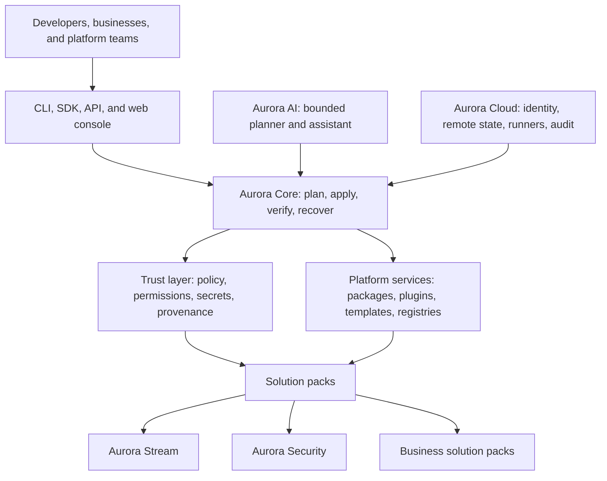

# Aurora Technologies Platform Roadmap

- **Status:** Working vision and execution roadmap
- **Roadmap version:** 0.1
- **Prepared:** August 10, 2026
- **Current Aurora master baseline:** `d0f1e4aa6b94b17f59767d440b167effd588ca71`
- **Current published CLI:** `@kin666/aurora-cli@0.1.0`

## 1. Executive intent

Aurora CLI should evolve from a project generator into the secure execution engine and local control plane for Aurora Technologies.

It should power Aurora Stream, future business software, defensive security tooling, Aurora AI, Aurora Cloud, and third-party solutions without hard-coding those products into the core. Each product should use the same public project model, package system, policy engine, transaction engine, extension API, and audit trail.

The central design decision is:

> Keep Aurora Core small, product-neutral, secure, and dependable. Build Aurora products as versioned solution packs on top of its public interfaces.

This makes Aurora CLI the foundation rather than merely one product among many.

## 2. The platform model

Aurora can be understood as five connected layers:

1. **Aurora Core and CLI** — the execution engine, project model, local control plane, transactions, policies, and command surface.
2. **Aurora Platform Services** — registries, packages, plugins, identity, configuration, secrets, updates, observability, and deployment adapters.
3. **Aurora Solution Packs** — Aurora Stream, Aurora Security, and reusable business-software blueprints.
4. **Aurora AI** — an optional, policy-bound planning and assistance layer that uses Core capabilities.
5. **Aurora Cloud** — shared organization state, remote execution, identity, policies, artifacts, audit history, and fleet management.



Aurora Core is the engine and heart. Aurora AI is a reasoning layer. Aurora Cloud provides shared memory and coordinated execution at organizational scale. Solution packs turn those capabilities into products.

## 3. Guiding principles

### 3.1 Plan before mutation

Every command that changes files, dependencies, infrastructure, or remote state must produce an inspectable plan first. The user must be able to approve, reject, export, or apply the plan.

### 3.2 Secure by default

Permissions are denied unless explicitly granted. File access, network access, subprocess execution, environment access, and secret access must be independently controlled.

### 3.3 Product-neutral core

Streaming, security, AI, and business-specific behavior belongs in solution packs. Core owns only reusable platform contracts and execution behavior.

### 3.4 Local-first, cloud-optional

Core project creation, validation, recovery, and package operations must remain useful without Aurora Cloud or an AI provider.

### 3.5 Declarative before executable

Prefer manifests, schemas, templates, migrations, and capability declarations over arbitrary installer scripts. Executable hooks are exceptional and receive stronger isolation and review.

### 3.6 Reversible operations

Mutating operations must be transactional where practical, with backups, an audit record, recovery instructions, and a tested rollback path.

### 3.7 Human control over AI

AI may propose plans, explain systems, generate files, and recommend remediation. It must not silently execute commands, disclose secrets, expand scope, or bypass policy.

### 3.8 Defensive and authorized security

Aurora Security must require explicit authorization and scope. It should default to safe, non-destructive testing and evidence-based remediation rather than uncontrolled exploitation.

## 4. Current foundation

Aurora CLI is already more than a simple prototype. Its major TypeScript areas contain more than 9,400 lines across command, core, kernel, runtime, package, feature, template, generator, service, configuration, container, and error modules.

The current validation inventory contains 17 test files and 61 `node:test` test cases. GitHub CI validates Node.js 22 and 24 on Linux and Windows. CodeQL, Dependabot, protected pull requests, exact-head checks, and SHA-pinned GitHub Actions are established. The current repository reports no open Dependabot security alerts.

### 4.1 Foundations already created

- Command registry and nested command tree
- Stable error codes and non-zero failure exits
- Dependency-injection container and service lifetimes
- Kernel boot, start, shutdown, and failure handling
- Runtime plugin lifecycle with rollback on activation failure
- Next.js template discovery and installation
- React component generation
- Feature manifests and transactional feature installation
- Package manifests and dependency graphs
- Topological package installation scheduling
- Package install, update, uninstall, repair, verify, and tree commands
- File backups, locks, caching, integrity records, transactions, rollback, and recovery
- Centralized CLI version metadata
- Restricted npm package contents
- Public npm package at version `0.1.0`
- Cross-platform release validation and installed-package smoke testing
- Repository security policy and protected contribution process

### 4.2 Existing code that should become the permanent platform

| Existing area | Future responsibility |
| --- | --- |
| Kernel, container, command registry | Aurora Core lifecycle and public service model |
| Templates, generators, and features | Blueprint and solution-pack engine |
| Package graph and version machinery | Reproducible component resolution |
| Transactions, backup, lock, recovery | Safe Operations Engine |
| Plugin runtime | Permissioned Extension Host |
| Error codes and reports | Stable automation and API contract |
| Release checks and CI | Release trust and compatibility gates |

### 4.3 Areas that are still prototypes

- The community and local repositories currently return no packages.
- The registry service contains unimplemented methods.
- The package publisher reports success but does not yet publish an artifact.
- Authentication and the sample Hello Plugin are lifecycle placeholders.
- The public plugin command supports listing but not a secure installation lifecycle.
- Project templates currently focus on one Next.js blueprint.
- Generators currently focus on React components.
- Some package APIs still use `any` rather than stable public contracts.
- `aurora --help` currently boots the runtime and activates plugins.
- External installer and hook JavaScript executes inside the main process.

These are appropriate gaps for an early `0.1.0` release. They now define the starting point for the roadmap.

## 5. Immediate security findings

The following must be resolved before Aurora accepts untrusted community extensions or runs cloud-managed tasks.

### 5.1 Project path boundary

Create one central Safe Path service used by every writer, copier, generator, installer, rollback manager, and recovery operation.

It must:

- Resolve an explicit project root once.
- Reject absolute child paths and traversal segments.
- Verify `path.relative` remains inside the root.
- Detect symbolic links, junctions, and reparse points.
- Refuse to follow links outside the project.
- Validate targets again immediately before mutation.
- Record the validated target in the operation plan and audit log.

### 5.2 Extension execution boundary

Plugins, package installers, and hooks must not execute untrusted JavaScript in the main Aurora process.

Introduce:

- A strict extension manifest.
- Declared capabilities for filesystem, network, environment, secrets, child processes, and commands.
- A separate extension worker process.
- Time, memory, output, and concurrency limits.
- User and organization policy evaluation before activation.
- A clear trust level: built-in, verified, community, or local development.
- Revocation and quarantine support.

Node's Permission Model can be used as defense in depth for trusted extension workers, but Node documents that it is not a complete boundary against malicious code: <https://nodejs.org/api/permissions.html>.

### 5.3 Subprocess safety

- Remove unnecessary `shell: true` execution.
- Replace shell strings with allowlisted executables and argument arrays.
- Use explicit environment allowlists.
- Add timeouts and cancellation.
- Capture and redact output consistently.
- Never let templates or AI produce an automatically executed command.
- Replace `git add .` with exact staging of transaction-owned files.

Node warns against passing untrusted input through shell-enabled child processes: <https://nodejs.org/api/child_process.html>.

### 5.4 Manifest and package trust

Manifest version 1 should be strict and include:

- Canonical package identifier
- Semantic version
- Aurora engine compatibility range
- Publisher identity
- Artifact digest
- Provenance reference
- Dependencies and conflicts
- Requested capabilities
- File and migration declarations
- Supported operating systems and architectures
- Deprecation and revocation state

Unknown manifest fields should be rejected or explicitly namespaced. Package IDs must not contain path separators or traversal sequences.

### 5.5 Secrets and identity

- Keep secrets out of `.aurora/config.json`.
- Use the operating system credential store for local credentials.
- Use short-lived tokens and device authorization for Aurora Cloud.
- Redact secrets, cookies, credentials, and authenticated URLs from output.
- Prevent `config list`, debug logs, reports, and AI context from exposing secrets.
- Record access to organization secrets in an audit trail.

### 5.6 Supply-chain security

- Publish Aurora CLI with npm Trusted Publishing and OIDC.
- Add repository metadata required for provenance.
- Generate provenance and artifact attestations.
- Produce an SBOM for every release.
- Verify package digests before extracting or executing content.
- Add dependency-review enforcement for pull requests.
- Protect release tags and environments.
- Support registry revocation and emergency deny lists.

References:

- <https://docs.npmjs.com/trusted-publishers/>
- <https://docs.npmjs.com/generating-provenance-statements/>
- <https://docs.github.com/en/code-security/how-tos/secure-your-supply-chain/manage-your-dependency-security/configure-dependency-review-action>
- <https://docs.github.com/en/actions/how-tos/secure-your-work/use-artifact-attestations/use-artifact-attestations>

## 6. Target command experience

Aurora should eventually present one coherent lifecycle:

```text
aurora create
aurora inspect
aurora plan
aurora apply
aurora verify
aurora test
aurora secure
aurora deploy
aurora observe
aurora upgrade
aurora recover
```

Global automation controls should include:

```text
--project <path>
--dry-run
--plan <file>
--json
--yes
--quiet
--no-color
--offline
--policy <file>
--timeout <duration>
```

Every machine-readable result should have a documented schema, stable error code, deterministic exit status, operation ID, and redacted diagnostic record.

## 7. Product architecture

### 7.1 Aurora Stream

Aurora Stream should become the first flagship solution pack and reference implementation of the platform.

Possible pack capabilities:

- Streaming application blueprint
- Catalog and metadata adapters
- Search and discovery
- Authentication and profiles
- My List and Continue Watching
- Recommendation providers
- Trailer and playback integrations
- Policy-compliant media-provider interfaces
- Observability and health checks
- Tests, deployment adapters, migrations, and upgrades

Aurora Stream should use only public Aurora Core interfaces. If Stream requires a private shortcut, improve the platform interface instead of embedding product-specific behavior in Core.

### 7.2 Aurora Security

Aurora Security should help authorized users assess and improve their own applications, websites, infrastructure, and software supply chains.

Initial defensive capabilities:

- Explicit scope and authorization manifest
- Asset and dependency inventory
- Secret detection
- Dependency and license analysis
- Static application security testing adapters
- Configuration and infrastructure-as-code review
- Container and SBOM inspection
- Web security checks with conservative rate limits
- Policy-as-code validation
- Findings normalization and severity handling
- SARIF, JSON, and human-readable reports
- Evidence retention and remediation plans
- CI quality gates

Dynamic testing must require an authorized target definition, rate and concurrency limits, safe defaults, and complete audit records. Destructive checks, credential attacks, uncontrolled scanning, persistence, and out-of-scope exploration must not be default Aurora capabilities.

### 7.3 Aurora AI

Aurora AI should enhance the platform without becoming a hidden or unrestricted executor.

Appropriate responsibilities:

- Explain projects, dependencies, policies, and findings.
- Translate user intent into a typed Aurora plan.
- Recommend solution packs and migrations.
- Generate files through approved generators.
- Propose security remediation.
- Summarize operations and audit history.
- Help businesses configure Aurora products.

Required safeguards:

- AI remains optional; deterministic CLI operation continues without it.
- Data classification and secret redaction occur before model access.
- Tools are allowlisted and capability-scoped.
- Mutations require plan review and approval.
- Prompt-injection and untrusted-content boundaries are tested.
- Provider, model, cost, and retention policies are configurable.
- Every AI action records inputs, tool calls, decisions, and approvals without recording secrets.
- Evaluation suites test safety, correctness, refusal, and regression behavior.

### 7.4 Aurora Cloud

Aurora Cloud should add capabilities that cannot be safely or conveniently provided by a local CLI alone:

- Organizations, projects, teams, and role-based access control
- Device authorization and short-lived credentials
- Remote state and configuration
- Encrypted secret management
- Trusted remote runners
- Artifact and package registry
- Policy distribution and enforcement
- Audit history and evidence retention
- Fleet upgrade management
- Usage metering and billing controls
- Web console and API
- Backups, disaster recovery, and regional controls

The CLI should remain the primary automation interface, while the cloud console provides visibility, governance, and collaboration.

### 7.5 Business solution packs

Businesses should be able to adopt Aurora through reusable, composable packs rather than one-off generated code.

Examples include:

- Authentication and organization management
- Database and API foundations
- Admin dashboards
- Billing and subscription workflows
- Notifications
- Audit and compliance evidence
- Customer portals
- Media and content systems
- Internal operations tools
- Deployment and observability stacks

Each pack should declare compatibility, dependencies, permissions, upgrade migrations, tests, and rollback behavior.

## 8. Phased roadmap

Milestone names and versions are working labels, not fixed dates. Advancement depends on exit gates, not calendar pressure.

### Phase 0 — Foundation (`0.1.x`, substantially complete)

**Goal:** Establish a real CLI runtime, public package, testing process, and safe contribution workflow.

Completed foundation:

- Kernel and container
- Command and error architecture
- Templates and generators
- Transactional feature and package installation
- Package dependency graph and scheduling
- Recovery and rollback
- Plugin lifecycle
- Public npm packaging
- Cross-platform release validation

**Exit gate:** Published `0.1.0`, clean master, protected PR workflow, and working CI. This gate has been reached.

### Phase 1 — Secure Core (`0.2`)

**Goal:** Make every local mutation predictable, contained, inspectable, and reversible.

Deliverables:

- Central Safe Path service
- Workspace and project-root model
- Plan/apply engine
- `--dry-run`, `--json`, `--yes`, `--quiet`, and `--no-color`
- Exact transaction-owned Git staging
- Hardened subprocess service
- Strict configuration schema
- Secret redaction and secure credential abstraction
- Side-effect-free help, version, and completion paths
- Fail-closed hook and installer error handling
- Threat model and security architecture decisions
- Malicious-path, symlink, command-injection, secret-leak, and rollback tests

**Exit gates:**

- No tested operation can write or delete outside its project root.
- Every mutating public command supports plan or dry-run behavior.
- Informational commands execute no extension code.
- No user-controlled value enters a shell command.
- Security regression tests run on Windows and Linux.

### Phase 2 — Public Platform SDK (`0.3`)

**Goal:** Convert internal foundations into stable, typed, product-neutral platform contracts.

Deliverables:

- Versioned Aurora project schema
- Manifest version 1
- Typed package, feature, template, generator, migration, and plugin APIs
- Capability and policy model
- Event and operation-report schemas
- Workspace dependency graph
- Public solution-pack SDK
- Compatibility and migration framework
- Documentation and example pack

**Exit gates:**

- A solution pack can be built without importing private Core modules.
- Compatibility errors are detected before mutation.
- Structured output is stable enough for CI and external tooling.
- Stream begins consuming only public SDK contracts.

### Phase 3 — Trusted Registry and Release (`0.4`)

**Goal:** Distribute Aurora packages and extensions with verifiable identity and reproducible installation.

Deliverables:

- Real official registry
- Real package build and publication pipeline
- Publisher identity and authorization
- Immutable artifacts and digest verification
- Provenance and attestations
- Reproducible Aurora lockfile
- Package revocation and quarantine
- Offline cache verification
- Trusted Publishing for Aurora CLI
- SBOM and dependency-review gates
- Declarative installer format
- Isolated workers for exceptional executable extensions

**Exit gates:**

- A locked project installs reproducibly on Windows and Linux.
- Artifact integrity is checked before extraction or execution.
- A compromised package can be revoked and blocked.
- No long-lived npm publish token is required.

### Phase 4 — Aurora Stream Reference Pack (`0.5`)

**Goal:** Prove that Aurora Core can create, upgrade, validate, and recover a substantial real product.

Deliverables:

- `aurora create stream`
- Stream blueprint and modular feature packs
- Auth, profile, catalog, discovery, playback, persistence, and recommendation adapters
- Environment and secret requirements
- Development and production profiles
- Tests, health checks, observability, and deployment plans
- Versioned Stream upgrades and rollback

**Exit gates:**

- A clean machine can create and validate a working Stream project.
- Stream upgrades are planned, testable, and reversible.
- Product-specific code remains outside Aurora Core.

### Phase 5 — Aurora Security (`0.6`)

**Goal:** Add a safe defensive-security product built on the same policy, package, report, and execution engine.

Deliverables:

- `aurora secure init`
- `aurora secure scan`
- `aurora secure verify`
- `aurora secure report`
- `aurora secure remediation-plan`
- Authorization and scope manifests
- Scanner adapter SDK
- Findings normalization
- SARIF and CI integration
- Policy packs
- Evidence and audit records
- Safe web-assessment runner

**Exit gates:**

- Scans cannot exceed an approved scope.
- Default checks are non-destructive and rate-limited.
- Findings include reproducible evidence and remediation guidance.
- Security tests cover misuse, scope escape, secret exposure, and report integrity.

### Phase 6 — Aurora AI (`0.7`)

**Goal:** Add a bounded reasoning and assistance layer over typed Aurora plans and tools.

Deliverables:

- Provider-neutral AI interface
- Intent-to-plan compiler
- Project explanation and guided setup
- Remediation and migration assistance
- Policy-bound tool access
- Human approval checkpoints
- Prompt-injection defenses
- Secret and sensitive-data filters
- Cost, model, retention, and organization policies
- Evaluation and regression framework

**Exit gates:**

- AI cannot mutate state outside the approved Aurora plan.
- Every tool call is attributable and auditable.
- Secret-exfiltration and prompt-injection evaluations pass.
- Core workflows remain functional without AI.

### Phase 7 — Aurora Cloud (`0.8–0.9`)

**Goal:** Coordinate Aurora across teams and organizations while preserving local control and strong isolation.

Deliverables:

- Identity, organizations, projects, and RBAC
- Device authorization and short-lived tokens
- Remote state and encrypted secrets
- Trusted runner architecture
- Central registry and artifact storage
- Organization policy service
- Audit and evidence service
- Fleet and upgrade management
- Web console and API
- Billing and usage controls
- Backup and disaster-recovery processes

**Exit gates:**

- Tenant isolation receives an independent security review.
- Remote actions require policy and identity checks.
- Audit records are tamper-evident and exportable.
- Recovery, key rotation, and incident procedures are tested.

### Phase 8 — Ecosystem and `1.0`

**Goal:** Establish Aurora as a dependable platform for third-party solutions and long-lived business use.

Deliverables:

- Stable Core and SDK APIs
- Community marketplace
- Publisher verification and trust tiers
- Extension review and certification
- Compatibility test service
- Deprecation and migration policy
- Long-term support policy
- Complete operator, developer, security, and incident documentation
- Enterprise governance and support model

**Exit gates:**

- Public APIs follow documented compatibility guarantees.
- Community code executes only inside enforced trust boundaries.
- Releases are reproducible and attributable.
- Incident response, revocation, migration, and rollback processes are operational.

## 9. First execution backlog

The following sequence starts directly from the present codebase:

1. **Architecture and terminology** — adopt this roadmap, define Core versus solution-pack boundaries, and record architecture decisions.
2. **Safe Path service** — centralize project containment and replace direct path joins in mutating code.
3. **Safe Process service** — remove shell execution, exact-stage generated files, and add timeouts and environment controls.
4. **Side-effect-free CLI bootstrap** — handle help, version, completion, and parsing before package or plugin activation.
5. **Manifest v1** — strict identifiers, SemVer, compatibility, capabilities, files, digests, and publisher fields.
6. **Plan/apply engine** — represent file, dependency, command, policy, and remote-state changes as typed operations.
7. **Structured output and audit record** — JSON schemas, operation IDs, stable result codes, and redaction.
8. **Credential abstraction** — separate non-secret configuration from OS-backed credentials.
9. **Extension worker prototype** — isolate one sample plugin with explicit permissions and resource limits.
10. **Real official registry design** — immutable artifacts, signed metadata, provenance, lockfile, and revocation.
11. **Stream solution-pack extraction** — model current Stream features through public pack APIs.
12. **Security product threat model** — define authorization, scanning scope, safe checks, evidence, and reporting before building scanners.

Items 1–9 should precede a public community marketplace. Stream can begin earlier as a trusted built-in reference pack, provided it uses the emerging public contracts.

## 10. Quality and security metrics

Progress should be measured by verifiable outcomes rather than number of commands.

### Core reliability

- Percentage of mutating commands supporting plan, dry-run, and rollback
- Transaction recovery success rate
- Cross-platform compatibility
- Deterministic output and exit-code coverage
- Upgrade and rollback test coverage

### Security

- Zero writes outside approved project roots in adversarial tests
- Zero shell execution involving user-controlled values
- Percentage of packages with verified digest and provenance
- Percentage of extension capabilities explicitly declared
- Secret-redaction test coverage
- Time to revoke a compromised package
- Security finding remediation time

### Developer experience

- Time from empty directory to validated project
- Number of manual steps required for common workflows
- Structured-output coverage
- Documentation task-completion rate
- Error messages with actionable remediation

### Platform adoption

- Number of products built entirely on public Core APIs
- Number of reusable verified solution packs
- Successful upgrades across supported versions
- Registry install success and rollback rates

## 11. Non-goals and boundaries

Aurora should not become:

- A monolithic codebase containing every product.
- A replacement for Git, npm, cloud providers, or established security tools.
- An unrestricted arbitrary-code runner.
- An autonomous offensive-security platform.
- An AI agent with silent terminal, secret, or production access.
- A cloud requirement for ordinary local development.
- A marketplace that treats downloaded code as trusted by default.

Aurora should orchestrate, standardize, secure, and simplify trusted tools through one coherent project and policy model.

## 12. Definition of the Aurora vision

Aurora Technologies provides a secure software foundation that helps individuals and organizations create, operate, protect, and evolve software.

Aurora Core supplies the execution engine. Aurora solution packs supply reusable products. Aurora Security helps authorized owners assess and improve their systems. Aurora AI helps people understand and operate the platform through bounded plans. Aurora Cloud coordinates these capabilities for teams and businesses.

The roadmap begins with the code that already exists. It does not discard the current CLI. It hardens and formalizes its strongest parts, then uses Aurora Stream as the first major proof that the platform can power real products safely.
